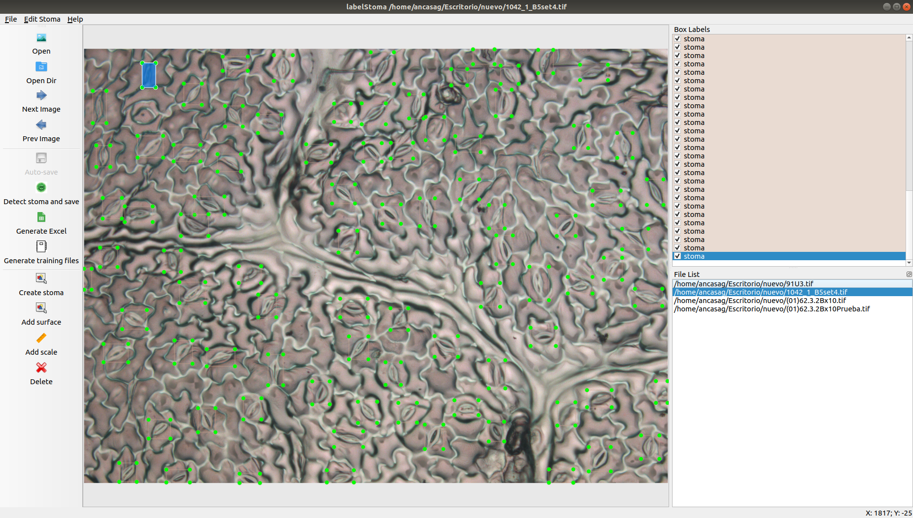

# LabelStoma
LabelStoma is a graphical image tool for automatically detecting stomata in images. In addition, LabelStoma also provides the necessary tools to correct the detections. LabelStoma is based on the [LabelImg tool](https://github.com/tzutalin/labelImg). A summary of the files included in this repository is provided in the following [document](https://docs.google.com/document/d/1CMV7xhy1Ko9hL__JhLgT3AgbzyyGs5yT3rTp_y7fjJQ/edit?usp=sharing).



# Documentation


0. [Installation](#installation-and-requirements)
1. [Datasets and Weights](#datasets-and-weights)
2. [Jupyter Notebook](#jupyter-notebook)
3. [Hotkeys](#hotkeys)
4. [Acknowledgements](#Acknowledgements)


## Installation and Requirements

LabelStoma can be run on Linux, Windows and macOS. 

### Get from PyPI but only python3.0 or above

LabelStoma can be installed both in Linux and Windows using pip.

``` 
pip install labelStoma
labelStoma
``` 

### Build from source

#### Using Linux
This tool requires Python 3.6 and Qt5 and the packages listed in the ```requirements.txt``` file.

1. Clone this repository.

```bash
git clone https://github.com/ancasag/labelStoma
```

2. Install the necessary dependencies.

```bash
cd labelStoma
sudo apt-get install pyqt5-dev-tools
pip3 install -r requirements.txt
make qt5py3
```

3. Run labelStoma:
```bash
python3 labelStoma.py
```
#### Using macOS

This tool requires Python 3.6 and Qt5 and the packages listed in the ```requirements.txt``` file.

1. Clone this repository.

```bash
git clone https://github.com/ancasag/labelStoma
```
2. Install the necessary dependencies.
```bash
brew install qt  # Install qt-5.x.x by Homebrew
brew install libxml2

or using pip

pip3 install pyqt5 lxml # Install qt and lxml by pip
make qt5py3
```
3. Run labelStoma:
```bash
python3 labelStoma.py
```

## Datasets and weights
We train various models for the three stoma varieties and for the combination of all. All models, results and tools are available below.
### Datasets for stoma detection

We have trained several models for the following datasets:

- SoyBean: [dataset](https://unirioja-my.sharepoint.com/:u:/g/personal/ancasag_unirioja_es/EfAKW-J0qoxDrf-0dA8KdecBen2ykSCFw7-Q7uNy5NkBmA?e=YzGdnX).
- CommonBean: [dataset](https://unirioja-my.sharepoint.com/:u:/g/personal/ancasag_unirioja_es/EduRx4pYGM5MkkOFPlGjDcQBlenQURHkvE-kEak_DrEwhw?e=8ipnXH).
- Barley: [dataset](https://unirioja-my.sharepoint.com/:u:/g/personal/ancasag_unirioja_es/EXMrTPceFDJCj6hr6dDa8noB4XUz8doCA-2Xw2dZsgdppA?e=Gdbxp3).
- All: [dataset](https://unirioja-my.sharepoint.com/:u:/g/personal/ancasag_unirioja_es/ERT9ADe8qBxCrmoW3NeiwW4BVg5rFmK0knJQXjqZgQ51Yw?e=lvp6nk).

### Weights for stoma detection
We have created several detection models for the aforementioned datasets using the algorithm YOLO. The trained models are available in the format used by YOLO framework, and distributed under the [GNU General Public License v3.0](https://www.gnu.org/licenses/gpl-3.0.html)


|    | SoyBean                                                                                                                                  | CommonBean                                                                                                                                        | Barley | Combined |
|-----------|------------------------------------------------------------------------------------------------------------------------------------------|---------------------------------------------------------------------------------------------------------------------------------------------------|--------|-----|
| None      | [weights](https://unirioja-my.sharepoint.com/:u:/g/personal/ancasag_unirioja_es/ESSf59327RtMlWWWPrLpZvUBKcb1XugGtrTKp_X93FhnWw?e=d4joj4) | [weights](https://unirioja-my.sharepoint.com/:u:/g/personal/ancasag_unirioja_es/ESiQL9o4uT1HuYQwB-s5baUBKpquE04vGbQSH1h-ZdqvTA?e=Q4DN3c) |[weights](https://unirioja-my.sharepoint.com/:u:/g/personal/ancasag_unirioja_es/EUOB8QbUJaBNp89uEkVhRd8BKo4L3_fbEGQzewR41zv9uQ?e=GFTT2d)|[weights](https://unirioja-my.sharepoint.com/:u:/g/personal/ancasag_unirioja_es/Ef59zvNCgotCjHP_Lk9hVGgB5LKb2TRpQXI52JLIfCYiNg?e=SLTSdA)|
| Geometric | [weights](https://unirioja-my.sharepoint.com/:u:/g/personal/ancasag_unirioja_es/EX8fpbZ9jjxNpxT2TMd77ZwBaBMNnZQuQojM3NaATBZutw?e=TAAGDu) | [weights](https://unirioja-my.sharepoint.com/:u:/g/personal/ancasag_unirioja_es/EWwBuzq1lA5LqafqT0YeV4QBZFQcz3tjqoqAGV4M2p5Gfg?e=pEdOto)           |[weights](https://unirioja-my.sharepoint.com/:u:/g/personal/ancasag_unirioja_es/EdaWdoh8SSpLqqe702ObgV4BuX9PaNCKqBTyH1-rZ8yeTw?e=nLQEDc)|[weights](https://unirioja-my.sharepoint.com/:u:/g/personal/ancasag_unirioja_es/EWfb7JRjP2NDjuKHbnZw3LMBCpFHa4Qz0VM8fYBCj4_vEA?e=8Hjg0t)|
| Colour    | [weights](https://unirioja-my.sharepoint.com/:u:/g/personal/ancasag_unirioja_es/EUm5m9FufjpCp1qxg2VfJ7UBjtoo9CeDw2hY8hHrPVKhCA?e=uiUkLT) | [weights](https://unirioja-my.sharepoint.com/:u:/g/personal/ancasag_unirioja_es/EYx8mWJ28IRDtgdtlgRzMgIBtnUc61egJ5XgFy5JEfXqZQ?e=187WEu) |[weights](https://unirioja-my.sharepoint.com/:u:/g/personal/ancasag_unirioja_es/ETiUZ4xlKktMnv5xre5zA78BGKWXkgop_xATsSOveSvyNA?e=y7SV4Z)|[weights](https://unirioja-my.sharepoint.com/:u:/g/personal/ancasag_unirioja_es/EWt5N4Lx9_hAtU3NSX1PreUB1g2BEu-8CHFWRuFzKsEOOw?e=Hovsui)|
| Combined      | [weights](https://unirioja-my.sharepoint.com/:u:/g/personal/ancasag_unirioja_es/EQ54TY_vuM9Opq9jTJ6oEJcB6U4iDy0ndkDjt6oJekdM2A?e=sqtX3U)  | [weights](https://unirioja-my.sharepoint.com/:u:/g/personal/ancasag_unirioja_es/EVwXi5essxdCpFTsdmjvZxQBG0Tw7tLqYif45_c2eSFnVw?e=ochbYl)           |[weights](https://unirioja-my.sharepoint.com/:u:/g/personal/ancasag_unirioja_es/ESf5G4PQqVdHn8qa94_GbgYBtms2qIjbCV-rtf1sZNOIVA?e=uSk9LB)|[weights](https://unirioja-my.sharepoint.com/:u:/g/personal/ancasag_unirioja_es/EdabyKpxEGNPsDPZ2nAyf4cBbCyCzHgwEk30zJQhhh5s_g?e=545Esy)|


## Jupyter Notebook

LabelStoma allows the creation of stoma detection models based on the YOLO detection algorithm. To do this, it generates a zip file with the structure required by this algorithm and a jupyter notebook with the appropriate steps to create a model. This [notebook](https://www.dropbox.com/s/9euz1j2eydbeimk/YOLOExampleDDStoma.ipynb?dl=1) can be downloaded from here. We also include two other notebooks; one that allows applying [test-time augmentation (TTA)](https://colab.research.google.com/drive/1hX1QGzH1PSbiaTld_UlMdMaKHrlwi2w5?usp=sharing) and the other that allows [progressive resizing](https://colab.research.google.com/drive/1Oqo1y4OoQ1eHyHwwpHvqWjCEb6eqUD8O?usp=sharing).

## Hotkeys
|          |                                |
|----------|--------------------------------|
| Ctrl + o | Open a image                   |
| Ctrl + u | Open a set of images           |
| Ctrl + q | Close the app                  |
| Ctrl + w | Close the image                |
| z        | Detect stomata                 |
| e        | Generate excel                 |
| r        | Create a new stoma detection   |
| w        | Create a new surface detection |
| l        | Create a new scale detection   |
| del      | Delete the selected rect box   |


## Acknowledgements
This work was partially supported by Ministerio de Economía y Competitividad [MTM2017-88804-P], Ministerio de Ciencia, Innovación y Universidades [RTC-2017-6640-7], and Agencia de Desarrollo Económico de La Rioja [2017-I-IDD-00018].
